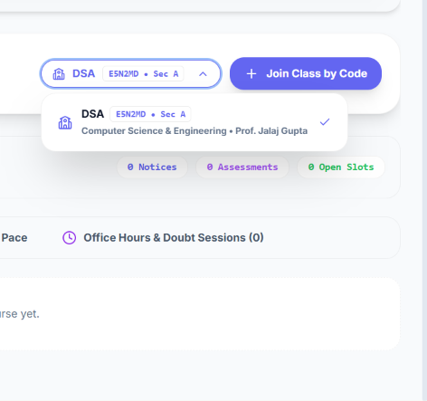
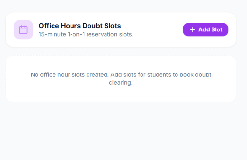
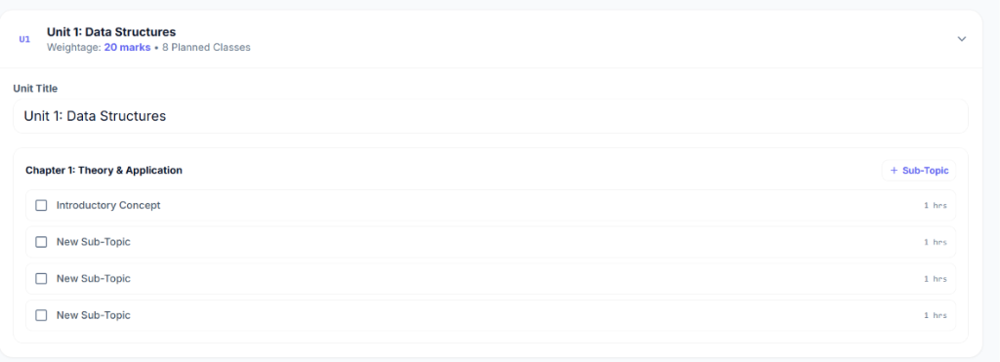
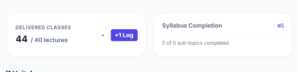
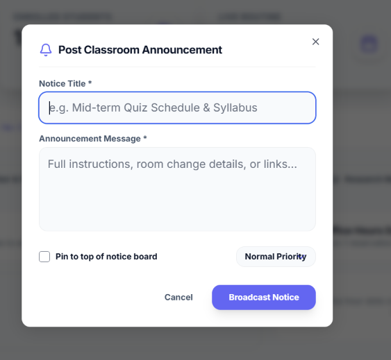
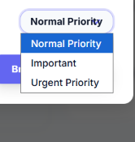
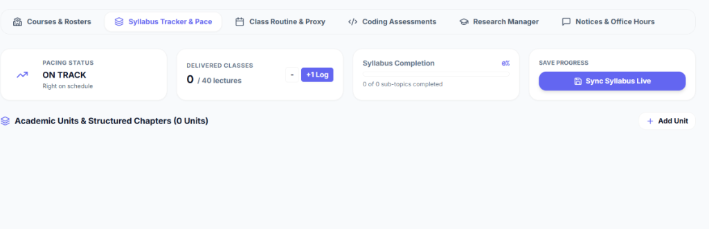
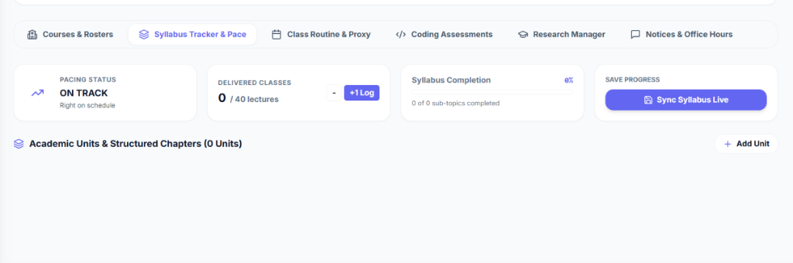

# 🚀 Placify Platform: Student & Teacher Modules Feature Guide & Visual Specification

A complete, module-by-module breakdown of all student and teacher academic, placement, and classroom features built into the **Placify** ecosystem.

---

## 📑 Table of Contents
- [1. 🎓 Student Academic & Placement Module](#1--student-academic--placement-module)
  - [1.1 Placement Command Center & Readiness Analytics](#11-placement-command-center--readiness-analytics)
  - [1.2 Academic Classroom Vault (`/classroom`)](#12-academic-classroom-vault-classroom)
  - [1.3 Sandboxed Monaco IDE Coding Assessments with Anti-Cheat](#13-sandboxed-monaco-ide-coding-assessments-with-anti-cheat)
  - [1.4 Job & Internship Applications Kanban Pipeline (`/applications`)](#14-job--internship-applications-kanban-pipeline-applications)
  - [1.5 1-on-1 Office Hours & Doubt Clearing Reservation](#15-1-on-1-office-hours--doubt-clearing-reservation)
  - [1.6 Class Timetable, Broadcast Notices & Course Unenrollment](#16-class-timetable-broadcast-notices--course-unenrollment)
  - [1.7 AI Placement Coach, Focus Drills & Group Study Hub](#17-ai-placement-coach-focus-drills--group-study-hub)
- [2. 👨‍🏫 Teacher & Faculty Academic Module](#2--teacher--faculty-academic-module)
  - [2.1 Course Command Center & 6-Character Code Enrollment](#21-course-command-center--6-character-code-enrollment)
  - [2.2 Smart AI Syllabus Generator & Course Pacing Engine](#22-smart-ai-syllabus-generator--course-pacing-engine)
  - [2.3 Proctored Coding Assessment Builder & Test Suite](#23-proctored-coding-assessment-builder--test-suite)
  - [2.4 Classroom Notice Board & Auto-Expiry Timers](#24-classroom-notice-board--auto-expiry-timers)
  - [2.5 Office Hours Time Window Generator & Doubt Hub](#25-office-hours-time-window-generator--doubt-hub)
  - [2.6 Weekly Routine & Proxy Substitution Scheduler](#26-weekly-routine--proxy-substitution-scheduler)
  - [2.7 Research Project Manager (Capstone & Ph.D. Kanban)](#27-research-project-manager-capstone--phd-kanban)
- [3. 🔒 Core Architectural Architecture & Security Rules](#3--core-architectural-architecture--security-rules)

---

# 1. 🎓 Student Academic & Placement Module

The Student Module is engineered to empower students across two essential pillars: **Academic Classroom Success** and **Tier-1 Tech Placement Preparation**.

---

### 1.1 Placement Command Center & Readiness Analytics

* **Automated Competency Matrix**: Real-time radar visualization measuring core technical mastery across Data Structures, Algorithms, System Design, Operating Systems, DBMS, and Computer Networks.
* **Dynamic Progress Rings**: Visual percentage tracker for completed placement topics and solved interview problems.
* **Weekly Activity Snapshot**: Day-by-day velocity chart tracking code commits, assessments taken, and drill consistency.
* **Streak Multiplier System**: Real-time streak tracking with flame indicators encouraging daily practice.
* **Daily Focus Queue**: Smart queue ordering priority problems based on spaced repetition intervals.

---

### 1.2 Academic Classroom Vault (`/classroom`)

Accessible directly from the desktop sidebar and mobile navigation, the **Classroom Vault** acts as the student's central digital campus.

```
+─────────────────────────────────────────────────────────────────────────────+
|  [School Icon]  Academic Classroom Vault             [ 2 Enrolled Classes ] |
|  Access live notices, take proctored tests, check timetable & book doubts.  |
|                                                                             |
|  [ Dropdown: DSA • E5N2MD • Sec A ]   [ + Join Class by Code ]              |
+─────────────────────────────────────────────────────────────────────────────+
```



#### Key Capabilities:
* **6-Character Code Enrollment**: Join any professor's classroom in seconds by entering a unique course code (e.g. `VD9222`, `E5N2MD`).
* **Multi-Course Switcher**: Custom animated dropdown with badges displaying course code, section, semester, and instructor name.
* **Instant Unenrollment (`UserMinus`)**: Students can leave a class anytime with a single click, protected by a safety confirmation modal.
* **Course Metadata Summary**: Displays live counts for active notices, pending assessments, and open doubt clearing slots.

---

### 1.3 Sandboxed Monaco IDE Coding Assessments with Anti-Cheat

Students can launch coding assessments published by their professors directly in a distraction-free, sandboxed Monaco editor.

* **Multi-Language Execution**: Native support for C++, Python, Java, and JavaScript.
* **Custom Test Runner**: Live compilation and standard I/O test case execution with feedback on runtime, memory, and output matching.
* **Active Anti-Cheat Proctoring Engine**:
  * **Tab-Switch & Blur Detection**: Detects whenever a student navigates away from the exam tab (e.g., to Google or AI tools) and records warning strikes.
  * **Copy-Paste Restriction**: Disallows pasting external code solutions into the editor.
  * **Full-Screen Enforcement**: Requires test-taking in full-screen mode.
  * **Auto-Submission Trigger**: Automatically submits and locks the test if maximum proctoring violation limits are breached.

---

### 1.4 Job & Internship Applications Kanban Pipeline (`/applications`)

A full-fledged applicant tracking system designed specifically for university placement drives.

* **Multi-Stage Kanban Columns**:
  1. *Bookmarked / Wishlist*
  2. *Applied*
  3. *Online Assessment (OA)*
  4. *Technical Interview Round 1 & 2*
  5. *HR / Behavioral Round*
  6. *Offer Received / Accepted / Rejected*
* **Company Metadata**: Salary/CTC fields, company logo, application deadline timer, interview venue/links, and custom notes.

---

### 1.5 1-on-1 Office Hours & Doubt Clearing Reservation

Students can reserve private 1-on-1 doubt clearing slots directly with their course instructor.



* **Browse Open Slots**: View available 15m, 30m, 45m, or 60m slots filtered by date and time.
* **Doubt Description Input**: Students enter the specific problem or theorem they need help with before confirming.
* **Direct Google Meet Access**: Automatically provides meeting links or professor cabin numbers upon booking.
* **One-Click Cancellation**: Students can cancel and release booked slots back to open availability if their doubt is already resolved.

---

### 1.6 Class Timetable, Broadcast Notices & Course Unenrollment

* **Weekly Routine**: Full weekly lecture and laboratory timetable displaying day, time, room number, and session type.
* **Broadcast Notice Board**: View announcements from teachers with priority styling:
  * **URGENT**: Red badge for exam dates and immediate deadlines.
  * **IMPORTANT**: Amber badge for syllabus updates and room changes.
  * **NORMAL**: Standard notices.
  * **Auto-Expiry Timers**: Live countdowns (e.g. `⏳ Expires in 2d`).
  * **Pinned Notices**: Important messages stay pinned to the top.

---

### 1.7 AI Placement Coach, Focus Drills & Group Study Hub

* **AI Coach**: Instant doubt clarification, code optimization recommendations, and mock technical interview questions.
* **Mock Timer Drills**: Timed problem-solving drills with focus timers.
* **Peer Group Study Hub**: Virtual study rooms, shared session timers, and peer leaderboards.

---

# 2. 👨‍🏫 Teacher & Faculty Academic Module

The Teacher Module provides professors, HODs, and teaching assistants with an automated academic command center.

---

### 2.1 Course Command Center & 6-Character Code Enrollment

* **Classroom Creation**: Instantly create course cohorts with automatic 6-character alphanumeric code generation (e.g. `E5N2MD`).
* **Active Classroom Selector**: Seamless custom dropdown to switch between teaching courses.
* **Student Roster Management**:
  * View all enrolled students with names, emails, and university roll numbers.
  * Update student status (`ACTIVE`, `WARNING`, `SUSPENDED`).
  * Remove or drop students from roster with one click.
* **Top-level KPI Metrics**: Real-time counts of active classrooms, enrolled student totals, live routine status, and armed anti-cheat status.

---

### 2.2 Smart AI Syllabus Generator & Course Pacing Engine

A next-generation curriculum planning and live lecture pacing tracker.




#### 1. Smart AI Syllabus Importer & Document Parser:
* **1-Click Curated Presets**: Instantly load complete, standardized university curriculums with realistic lecture hours and 100-mark weightages for:
  * *Data Structures & Algorithms (42 Lectures, 6 Units)*
  * *Operating Systems & System Architecture (40 Lectures, 5 Units)*
  * *Database Management Systems (38 Lectures, 5 Units)*
  * *Computer Networks & Protocols (40 Lectures, 5 Units)*
* **Smart Raw Text / Document Parser**: Paste raw syllabus text from PDFs, university portals, or Word docs. The parser automatically extracts Units, Chapters, and Sub-topics, allocates realistic planned lecture hours based on topic complexity, and balances marks weightage to 100 marks.

#### 2. Dynamic Planned Classes & Real-Time Velocity:
* **Dynamic Total Planned Lectures**: Automatically sums all unit planned lectures:
  $$\text{Total Planned Lectures} = \sum \text{Unit Planned Lectures}$$
* **Live Delivered Classes Tracker**: Single-click `+1 Log` and `-` buttons with overtime tracking (e.g. `44 / 42 Lectures (+2 overtime)`).
* **Live Pacing Status Badge**:
  * **🚀 Ahead of Schedule**: Class velocity outpaces syllabus requirements.
  * **✅ On Pace (Optimal)**: Perfect alignment between delivered lectures and topics completed.
  * **⚠️ Behind Schedule**: Prompts the teacher that extra makeup classes are required.
* **Instant Reactive Check-off**: Toggling sub-topic checkboxes instantly updates the progress bar and completion percentage in real time.
* **Full Inline Editing**: Directly edit Unit titles, marks weightage, planned classes, chapter names, sub-topic descriptions, and planned hours without modal dialogs.

---

### 2.3 Proctored Coding Assessment Builder & Test Suite

Teachers can author coding tests for their classes with integrated test cases.

* **Problem Authoring**: Markdown description editor, input/output format specifications, constraints, and time/memory limits.
* **Public & Hidden Test Cases**: Add public sample test cases (visible to students) and private evaluation test cases (for grading).
* **Submission Gradebook**: Review student code submissions, test case passes, execution runtime, and proctoring violation logs.

---

### 2.4 Classroom Notice Board & Auto-Expiry Timers

Broadcast announcements to all enrolled students with advanced lifecycle management.




* **Priority Levels**: Tag announcements as `NORMAL`, `IMPORTANT`, or `URGENT`.
* **Pinned Announcements**: Pin critical updates (e.g. Exam dates) to remain at the top of the notice board.
* **Auto-Expire Timers**:
  * `Never (Persistent)`
  * `Expires in 24 Hours (1 Day)`
  * `Expires in 3 Days`
  * `Expires in 7 Days (1 Week)`
  * `Custom Expiry Date & Time`
* **Edit & Delete Controls**: ✏️ Edit existing notice text/timers or 🗑️ permanently remove expired notices.
* **Theme-Adaptive Dropdown UI**: Modern custom dropdowns replacing OS native selects.

---

### 2.5 Office Hours Time Window Generator & Doubt Hub

Easily open availability windows for student doubt resolution.



* **Time Window Generator**: Select a date and a 1–2 hour window (e.g. 14:00 – 16:00) and select an interval (15m, 30m, 45m, 60m, or continuous).
* **Batch Slot Publishing**: Automatically splits and creates all reservation slots in Firestore in a single click.
* **Live Roster of Bookings**: View which student reserved which slot, their university roll number, and their doubt description.
* **One-Click Reopening**: Teachers can cancel a booking to reopen the slot with one click (`Undo2`).

---

### 2.6 Weekly Routine & Proxy Substitution Scheduler

* **Weekly Class Routine**: Manage daily lecture and lab allocations with time, subject, and classroom hall numbers.
* **Proxy Teacher Substitution**: Assign temporary faculty replacements when on leave, automatically alerting students in their timetable view.

---

### 2.7 Research Project Manager (Capstone & Ph.D. Kanban)

A multi-phase project tracking system for student research groups and capstone teams.



#### 6-Stage Research Lifecycle:
1. `LITERATURE_REVIEW` (Literature Review)
2. `METHODOLOGY` (Methodology & Design)
3. `DATA_COLLECTION` (Data Collection & Prep)
4. `IMPLEMENTATION` (Model / Code Build)
5. `REPORT_DRAFTING` (Paper / Report Draft)
6. `APPROVED` (Approved & Published)

#### Advanced Controls:
* **Backward & Forward Navigation**:
  * **`← Back` Button**: Revert any project back to earlier phases for revisions.
  * **`Advance →` Button**: Advance projects upon meeting phase criteria.
* **Direct Phase Stepper**: Click any milestone in the Project Details modal to jump directly to that phase.
* **Edit Project Details**: ✏️ Modify Project Title, Domain, Abstract, Team Lead Name, Lead Roll Number, Co-Researchers, and Phase.
* **Delete Project**: 🗑️ Permanently remove draft or cancelled research groups with safety confirmation.

---

# 3. 🔒 Core Architectural Architecture & Security Rules

### Firestore Data Model Overview:
```
courses/{courseId}
  ├── roster/{studentUid}           --> Enrolled student record & status
  ├── syllabus/main                 --> Units, chapters, subtopics, pacingMetrics
  ├── notices/{noticeId}            --> Broadcast announcements & expiry timers
  ├── assessments/{assessmentId}    --> Coding challenges, test cases & rules
  │     └── submissions/{subId}     --> Student code submissions & proctor logs
  └── research/{projectId}          --> Capstone & Ph.D. project Kanban records

officeHours/{slotId}                --> 15-60m reservation slots & bookings
users/{studentUid}/enrolledCourses  --> Student enrolled course documents
```

### Security & Privacy:
* **Role-Based Access Control (RBAC)**: Strict segregation between `student`, `teacher`, and `phd` roles.
* **Sandboxed Test Isolation**: Students can only access active assessment test cases during open exam windows without source leakage.
* **Encrypted Credential Storage**: All personal user metadata and submissions are protected by strict Firestore rules.

---

*Documentation prepared for the Placify platform.*
